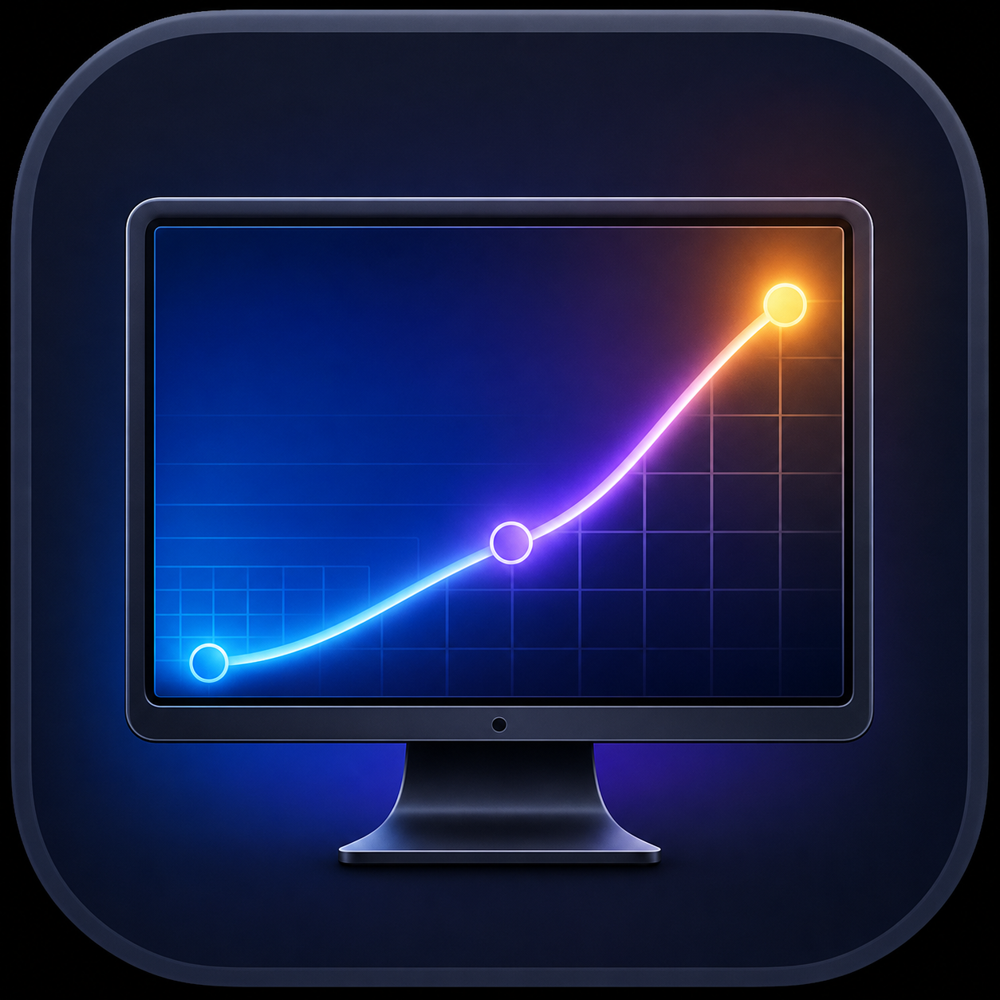

<p align="center">
  
</p>

<h1 align="center">LumaFlow</h1>

<p align="center">
  <strong>让每一块屏幕，都按照你的习惯工作。</strong>
</p>

<p align="center">
  原生 macOS 显示器管理工具，提供平滑分辨率缩放、跨显示器键盘亮度控制、<br>
  原生风格亮度 HUD，以及按显示器自动恢复设置。
</p>

<p align="center">
  
  
  
  
</p>

---

## 为什么是 LumaFlow

| 平滑缩放 | 焦点屏幕控制 | 无感恢复 |
|:--|:--|:--|
| 默认分辨率对应 100%，以 3% 为步进切换 HiDPI 模式 | 键盘亮度键只调节当前焦点窗口所在的显示器 | 每台显示器分别保存分辨率、亮度、对比度和色温 |
| 自动匹配原生宽高比和最高可用刷新率 | 调节时在目标屏幕显示原生风格亮度 HUD | 断开并重新接入后自动恢复上次设置 |

## 核心功能

### 分辨率与缩放

- 自动检测内建屏幕和外接显示器。
- 仅展示与面板原生宽高比一致的分辨率。
- 自动选用显示器可用的最高刷新率：支持 120 Hz 的屏幕使用 120 Hz，只支持 60 Hz 的屏幕使用 60 Hz。
- 将 macOS 默认分辨率定义为 `100%`，其他分辨率按相对百分比显示。
- 支持以 `100%` 为锚点的 3% 缩放步进。
- 系统缺少密集 HiDPI 模式时，可以备份并安装显示器 override 配置。
- 分辨率切换带淡入淡出过渡、15 秒确认和自动回滚。
- 主窗口与菜单栏均提供分辨率滑杆。

> 滑杆只能切换 macOS 实际提供的显示模式。首次启用 3% 灵活缩放后需要重启 Mac，新的 HiDPI 模式才会生效。

### 亮度与画面

- 内建屏幕和 Apple 显示器使用系统硬件亮度接口。
- Apple Silicon 外接显示器优先使用 DDC/CI 硬件亮度。
- 显示器或连接链路不支持 DDC/CI 时，自动回退到 Gamma 软件调光。
- 提供亮度、对比度和冷暖色温调节。
- 键盘亮度键只修改当前焦点窗口所在的显示器。
- 按键调节时，在目标显示器中央显示太阳图标、分段亮度条和百分比。
- `Option + Shift + 亮度键` 支持 1% 精细调节，长按可连续调节。

### 菜单栏体验

- 专属单色“显示器＋缩放曲线”菜单栏图标，自动适配深浅色模式。
- 无需打开主窗口即可调整分辨率和亮度。
- 菜单栏选择分辨率后自动保留，不会在倒计时后恢复。
- “打开主窗口”会自动创建、取消最小化并将窗口置于最前。
- 可在应用设置中隐藏 Dock 图标，仅保留菜单栏入口。

### 按显示器保存

LumaFlow 使用厂商、产品和序列号识别显示器，分别保存：

- 分辨率与刷新率
- 亮度
- 对比度
- 色温

显示器重新接入后会自动恢复对应设置，各屏幕互不影响。

## 系统要求

- macOS 14 或更高版本
- Xcode 与 Swift 5.10 或更高版本
- DDC/CI 硬件控制目前面向 Apple Silicon

外接屏能否进行硬件亮度控制取决于显示器、线缆、扩展坞和连接协议。部分 HDMI 转接器、DisplayLink 设备或关闭了 DDC/CI 的显示器只能使用软件调光。

## 构建与安装

### 直接运行

```bash
swift run LumaFlow
```

### 构建应用包

```bash
./scripts/build-app.sh
open dist/LumaFlow.app
```

构建脚本优先使用钥匙串中的 Developer ID Application 或 Apple Development 证书，使应用更新后保持稳定的辅助功能授权身份；没有可用证书时会回退到 ad-hoc 签名。

如需安装到“应用程序”目录：

```bash
ditto dist/LumaFlow.app /Applications/LumaFlow.app
open /Applications/LumaFlow.app
```

### 运行测试

```bash
swift test
```

## 发布 Release

仓库包含 `.github/workflows/release.yml`。在 GitHub 的 **Actions → Release**
中点击 **Run workflow**，输入不带 `v` 的语义化版本号，例如 `1.0.0`。

发布流程会自动：

1. 校验版本号并避免覆盖已有 Release。
2. 写入应用版本和构建编号。
3. 运行测试并构建 macOS 应用。
4. 验证应用签名和 Bundle 版本。
5. 生成 ZIP 安装包与 SHA-256 校验文件。
6. 创建 `v版本号` 标签和 GitHub Release。

也可以通过 GitHub CLI 触发：

```bash
gh workflow run release.yml --ref main -f version=1.0.0
```

## 首次配置

### 键盘亮度键

1. 将 LumaFlow 安装到 `/Applications`。
2. 打开应用并点击“授权键盘控制”。
3. 在“系统设置 → 隐私与安全性 → 辅助功能”中启用 LumaFlow。
4. 返回应用，授权状态会自动刷新。

如果使用 ad-hoc 签名重新构建，macOS 可能要求重新授权。使用稳定的 Apple Development 或 Developer ID 签名可以避免更新后应用身份变化。

### 3% 灵活缩放

点击“一键启用 3% 灵活缩放”后，LumaFlow 会：

1. 备份已有的显示器 override 配置。
2. 合并写入细分 HiDPI 分辨率。
3. 请求管理员权限安装到 `/Library/Displays`。
4. 提示重启 Mac。

应用内可以恢复安装前的配置。

## 项目结构

```text
Sources/LumaFlow/
├── DisplayService.swift              # 显示器枚举、模式切换与状态协调
├── DisplayHardwareController.swift   # Apple 亮度与 DDC/CI 控制
├── BrightnessKeyMonitor.swift        # 全局亮度媒体键监听
├── BrightnessHUDController.swift     # 多显示器原生风格亮度 HUD
├── DisplaySettingsStore.swift        # 按显示器持久化
├── FlexibleScalingInstaller.swift    # 3% HiDPI override 安装与恢复
├── MenuBarIcon.swift                 # 自绘模板菜单栏图标
├── ContentView.swift                 # 主窗口
└── MenuBarView.swift                 # 菜单栏控制
```

## 项目说明

LumaFlow 的设计受到 BetterDisplay 工作流的启发，但与 BetterDisplay、MonitorControl 没有关联。

DDC/CI 部分参考了 MIT 许可的 [MonitorControl](https://github.com/MonitorControl/MonitorControl)，许可信息见 [THIRD_PARTY_NOTICES.md](THIRD_PARTY_NOTICES.md)。
